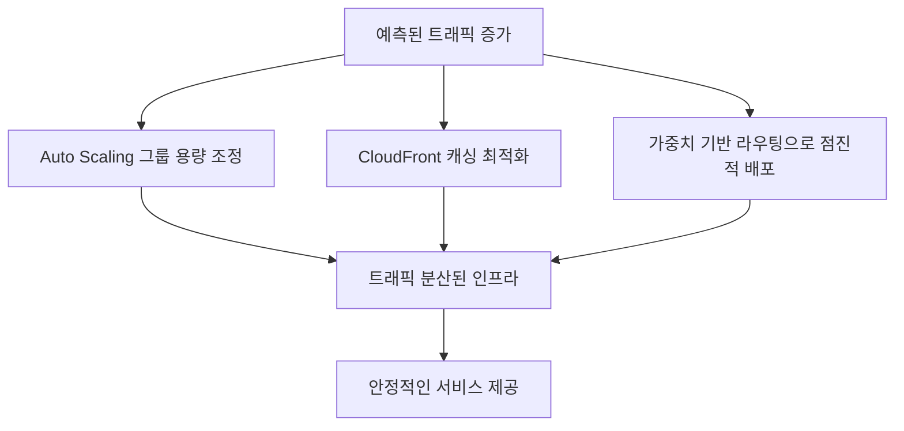



# 🌐 AWS Route 53: 레코드 설정과 트래픽 관리의 모든 것

AWS Route 53은 확장성이 뛰어난 클라우드 DNS(Domain Name System) 웹 서비스로, 도메인 등록과 DNS 라우팅, 상태 확인 등 다양한 기능을 제공합니다. 이 글에서는 Route 53의 다양한 레코드 유형과 트래픽 증가 시 효과적인 관리 방법에 대해 알아보겠습니다.

## 📋 Route 53 레코드 유형 완벽 가이드

Route 53은 다양한 DNS 레코드 유형을 지원하며, 각각 고유한 용도와 특성을 가지고 있습니다.


| 레코드 유형 | 설명                                  | 주요 사용 사례                     | 예시                                                         |
| ----------- | ------------------------------------- | ---------------------------------- | ------------------------------------------------------------ |
| **A**       | 도메인 이름을 IPv4 주소로 매핑        | 웹 서버, EC2 인스턴스 연결         | `example.com → 192.0.2.1`                                    |
| **AAAA**    | 도메인 이름을 IPv6 주소로 매핑        | IPv6 지원 리소스 연결              | `example.com → 2001:0db8:85a3::8a2e:0370:7334`               |
| **CNAME**   | 한 도메인을 다른 도메인 이름으로 매핑 | 하위 도메인을 다른 도메인으로 연결 | `www.example.com → example.com`                              |
| **MX**      | 메일 서버 정보 제공                   | 이메일 라우팅                      | `example.com MX 10 mail.example.com`                         |
| **TXT**     | 텍스트 데이터 저장                    | 도메인 소유권 확인, SPF 레코드     | `example.com TXT "v=spf1 include:_spf.example.com ~all"`     |
| **NS**      | 도메인의 네임서버 지정                | DNS 위임                           | `example.com NS ns1.example.com`                             |
| **SOA**     | 도메인의 권한 정보                    | DNS 영역 관리 정보                 | 시리얼 번호, 리프레시 타임 등 포함                           |
| **PTR**     | IP 주소를 도메인 이름으로 역변환      | 역방향 DNS 조회                    | `1.2.0.192.in-addr.arpa → example.com`                       |
| **SRV**     | 특정 서비스 제공 서버 정보            | VoIP, XMPP 등 서비스 검색          | `_sip._tcp.example.com SRV 10 60 5060 sipserver.example.com` |
| **CAA**     | SSL/TLS 인증서 발급 권한 제어         | 인증서 발급 제한                   | `example.com CAA 0 issue "letsencrypt.org"`                  |
| **NAPTR**   | 정규식 기반 이름 변환 규칙            | ENUM, SIP 등 통신 프로토콜         | 전화번호를 URI로 매핑                                        |
| **DS**      | DNSSEC 위임 서명자                    | DNS 보안 확장                      | 해시된 공개 키 저장                                          |
| **TLSA**    | TLS 인증서 정보                       | 인증서 유효성 검증                 | `_443._tcp.example.com TLSA 3 0 1 [해시값]`                  |
| **SPF**     | 이메일 발신 서버 정책                 | 스팸 방지 (현재는 TXT로 통합)      | `v=spf1 ip4:192.0.2.0/24 ~all`                               |

## 🚦 트래픽 관리를 위한 Route 53 라우팅 정책

트래픽 증가 상황에 효과적으로 대응하기 위해 Route 53은 다양한 라우팅 정책을 제공합니다.

### 주요 라우팅 정책 비교

| 라우팅 정책               | 작동 방식                           | 최적 사용 시나리오                                     | 특징                                                                                                |
| ------------------------- | ----------------------------------- | ------------------------------------------------------ | --------------------------------------------------------------------------------------------------- |
| **단순 라우팅**           | 단일 리소스로 트래픽 전달           | 단일 웹 서버, 단일 리전 애플리케이션                   | • 가장 기본적인 라우팅<br>• 설정이 간단함<br>• 장애 조치 없음                                       |
| **가중치 기반 라우팅**    | 지정된 비율에 따라 트래픽 분산      | • 블루/그린 배포<br>• A/B 테스팅<br>• 다중 리전 배포   | • 각 리소스에 0-255 가중치 할당<br>• 비율 기반 트래픽 분산<br>• 점진적 마이그레이션 용이            |
| **지연 시간 기반 라우팅** | 최소 지연 시간 제공 리전으로 라우팅 | 글로벌 사용자 기반 애플리케이션                        | • AWS 리전 간 지연 시간 측정<br>• 사용자별 최적 성능 제공<br>• 자동 트래픽 재분배                   |
| **장애 조치 라우팅**      | 기본 리소스 장애 시 백업으로 전환   | 고가용성이 중요한 애플리케이션                         | • 활성/비활성 구성<br>• 자동 장애 감지<br>• 상태 확인 통합                                          |
| **지리적 라우팅**         | 사용자 위치 기반 라우팅             | • 콘텐츠 현지화<br>• 규제 준수<br>• 지역별 서비스 제공 | • 대륙, 국가, 미국 주 단위 구성<br>• 지역별 사용자 경험 최적화<br>• 규제 요구사항 충족              |
| **지리적 근접성**         | 리소스와 사용자 간 거리 기반        | 리소스가 여러 지역에 분산된 경우                       | • 바이어스 값으로 영향 범위 조정<br>• AWS 및 비AWS 리소스 지원<br>• Traffic Flow 시각적 편집기 필요 |
| **다중값 응답**           | 최대 8개의 건강한 레코드 반환       | 간단한 DNS 기반 로드 밸런싱                            | • 여러 값을 무작위 순서로 반환<br>• 상태 확인 통합<br>• 기본적인 장애 조치                          |
| **IP 기반 라우팅**        | 사용자 IP 주소 범위에 따른 라우팅   | ISP 또는 기업 네트워크 기반 라우팅                     | • CIDR 블록으로 IP 범위 지정<br>• 통신사별 최적화<br>• 기업 네트워크 특화 라우팅                    |

### 라우팅 정책 구현 예제

#### 지연 시간 기반 라우팅 설정 (AWS CLI)

```bash
# 미국 동부와 유럽 리전에 배포된 애플리케이션을 위한 지연 시간 기반 레코드 생성
aws route53 change-resource-record-sets \
  --hosted-zone-id Z1D633PJN98FT9 \
  --change-batch '{
    "Changes": [
      {
        "Action": "CREATE",
        "ResourceRecordSet": {
          "Name": "app.example.com",
          "Type": "A",
          "SetIdentifier": "us-east-1",
          "Region": "us-east-1",
          "TTL": 60,
          "ResourceRecords": [
            {
              "Value": "54.236.178.210"
            }
          ]
        }
      },
      {
        "Action": "CREATE",
        "ResourceRecordSet": {
          "Name": "app.example.com",
          "Type": "A",
          "SetIdentifier": "eu-west-1",
          "Region": "eu-west-1",
          "TTL": 60,
          "ResourceRecords": [
            {
              "Value": "34.241.138.23"
            }
          ]
        }
      }
    ]
  }'
```

#### 가중치 기반 트래픽 분산 (AWS CLI)

```bash
# 새 버전으로 트래픽을 점진적으로 이동하는 가중치 기반 레코드
aws route53 change-resource-record-sets \
  --hosted-zone-id Z1D633PJN98FT9 \
  --change-batch '{
    "Changes": [
      {
        "Action": "CREATE",
        "ResourceRecordSet": {
          "Name": "www.example.com",
          "Type": "A",
          "SetIdentifier": "version-1",
          "Weight": 80,
          "TTL": 60,
          "ResourceRecords": [
            {
              "Value": "192.0.2.1"
            }
          ]
        }
      },
      {
        "Action": "CREATE",
        "ResourceRecordSet": {
          "Name": "www.example.com",
          "Type": "A",
          "SetIdentifier": "version-2",
          "Weight": 20,
          "TTL": 60,
          "ResourceRecords": [
            {
              "Value": "192.0.2.2"
            }
          ]
        }
      }
    ]
  }'
```

## 🚀 트래픽 증가 시나리오별 대응 전략

### 1. 예측 가능한 트래픽 증가 (이벤트, 프로모션)



**구현 단계:**

1. **사전 인프라 확장:**

   - Auto Scaling 그룹의 최소/최대 용량 증가
   - 예약 인스턴스 또는 스팟 인스턴스 활용

2. **캐싱 최적화:**

   ```json
   {
     "DefaultCacheBehavior": {
       "MinTTL": 1800,
       "DefaultTTL": 3600,
       "MaxTTL": 86400,
       "ForwardedValues": {
         "QueryString": false,
         "Cookies": {
           "Forward": "none"
         }
       }
     }
   }
   ```

3. **단계적 트래픽 증가:**
   - 초기에는 가중치 기반 라우팅으로 10%만 새 인프라로 라우팅
   - 안정성 확인 후 점진적으로 30%, 50%, 100%로 증가

### 2. 갑작스러운 트래픽 급증 (DDoS, 바이럴 콘텐츠)

**대응 방안:**

- **AWS Shield + WAF 활성화:** 악의적 트래픽 필터링
- **CloudFront 활용:** 엣지 로케이션으로 부하 분산
- **다중 리전 배포 + 지연 시간 기반 라우팅:** 트래픽 글로벌 분산

**Shield Advanced 설정 예시:**

```json
{
  "Protection": {
    "Id": "protection-123",
    "Name": "WebAppProtection",
    "ResourceArn": "arn:aws:cloudfront::123456789012:distribution/EDFDVBD6EXAMPLE"
  },
  "ProtectionGroupConfig": {
    "AggregationType": "SUM",
    "Pattern": "ARBITRARY",
    "ResourceTypeToProtect": "CLOUDFRONT_DISTRIBUTIONS"
  }
}
```

### 3. 글로벌 확장 시나리오

**구현 아키텍처:**

| 구성 요소                      | 목적                               | 설정 방법                          |
| ------------------------------ | ---------------------------------- | ---------------------------------- |
| **글로벌 액셀러레이터**        | 전 세계 AWS 백본 네트워크 활용     | 엔드포인트 그룹을 여러 리전에 구성 |
| **다중 리전 배포**             | 지역별 최적화된 서비스 제공        | 각 리전에 동일 애플리케이션 배포   |
| **지리적 라우팅**              | 사용자를 가장 가까운 리전으로 연결 | 국가/대륙별 Route 53 레코드 설정   |
| **DynamoDB 글로벌 테이블**     | 글로벌 데이터 복제                 | 여러 리전에 테이블 복제 활성화     |
| **Aurora 글로벌 데이터베이스** | 낮은 지연 시간의 글로벌 읽기       | 기본 리전과 보조 리전 구성         |

**글로벌 액셀러레이터 설정 (AWS CLI):**

```bash
# 글로벌 액셀러레이터 생성
aws globalaccelerator create-accelerator \
  --name my-global-app \
  --ip-address-type IPV4 \
  --enabled

# 리스너 생성
aws globalaccelerator create-listener \
  --accelerator-arn arn:aws:globalaccelerator::123456789012:accelerator/1234abcd-abcd-1234-abcd-1234abcdefgh \
  --port-ranges '[{"FromPort":80,"ToPort":80},{"FromPort":443,"ToPort":443}]' \
  --protocol TCP

# 여러 리전에 엔드포인트 그룹 추가
aws globalaccelerator create-endpoint-group \
  --listener-arn arn:aws:globalaccelerator::123456789012:accelerator/1234abcd-abcd-1234-abcd-1234abcdefgh/listener/abcdef1234 \
  --endpoint-group-region us-east-1 \
  --endpoint-configurations '[{"EndpointId":"arn:aws:elasticloadbalancing:us-east-1:123456789012:loadbalancer/app/my-lb/1234567890abcdef"}]'

aws globalaccelerator create-endpoint-group \
  --listener-arn arn:aws:globalaccelerator::123456789012:accelerator/1234abcd-abcd-1234-abcd-1234abcdefgh/listener/abcdef1234 \
  --endpoint-group-region ap-northeast-2 \
  --endpoint-configurations '[{"EndpointId":"arn:aws:elasticloadbalancing:ap-northeast-2:123456789012:loadbalancer/app/my-lb-seoul/0987654321abcdef"}]'
```

## 📊 Route 53 상태 확인 및 장애 조치 구성

트래픽 증가 시 서비스 안정성을 유지하기 위한 상태 확인 및 장애 조치 전략:

### 상태 확인 유형

| 상태 확인 유형       | 모니터링 대상         | 사용 사례                      |
| -------------------- | --------------------- | ------------------------------ |
| **HTTP/HTTPS**       | 엔드포인트 URL        | 웹 서버, API 엔드포인트        |
| **TCP**              | 특정 포트 연결성      | 데이터베이스, 캐시 서비스      |
| **CloudWatch 경보**  | 지표 기반 상태        | 리소스 성능, 애플리케이션 상태 |
| **계산된 상태 확인** | 다른 상태 확인의 조합 | 복잡한 의존성이 있는 시스템    |

### 장애 조치 구성 예제 (AWS CLI)

```bash
# 기본 엔드포인트에 대한 상태 확인 생성
aws route53 create-health-check \
  --caller-reference 2014-07-192 \
  --health-check-config '{
    "IPAddress": "192.0.2.1",
    "Port": 80,
    "Type": "HTTP",
    "ResourcePath": "/health",
    "FullyQualifiedDomainName": "primary.example.com",
    "RequestInterval": 30,
    "FailureThreshold": 3
  }'

# 장애 조치 레코드 구성 (기본)
aws route53 change-resource-record-sets \
  --hosted-zone-id Z1D633PJN98FT9 \
  --change-batch '{
    "Changes": [
      {
        "Action": "CREATE",
        "ResourceRecordSet": {
          "Name": "failover.example.com",
          "Type": "A",
          "SetIdentifier": "primary",
          "Failover": "PRIMARY",
          "TTL": 60,
          "ResourceRecords": [
            {
              "Value": "192.0.2.1"
            }
          ],
          "HealthCheckId": "abcdef11-2222-3333-4444-555555fedcba"
        }
      },
      {
        "Action": "CREATE",
        "ResourceRecordSet": {
          "Name": "failover.example.com",
          "Type": "A",
          "SetIdentifier": "secondary",
          "Failover": "SECONDARY",
          "TTL": 60,
          "ResourceRecords": [
            {
              "Value": "192.0.2.2"
            }
          ]
        }
      }
    ]
  }'
```

## 🔄 AWS 서비스 통합을 통한 트래픽 관리

Route 53은 다양한 AWS 서비스와 통합하여 트래픽 관리 솔루션을 제공합니다.

| AWS 서비스                  | 통합 방식   | 트래픽 관리 이점                                                    |
| --------------------------- | ----------- | ------------------------------------------------------------------- |
| **Elastic Load Balancing**  | 별칭 레코드 | • 자동 스케일링<br>• 상태 기반 라우팅<br>• 부하 분산                |
| **CloudFront**              | 별칭 레코드 | • 전역 엣지 캐싱<br>• DDoS 방어<br>• SSL/TLS 오프로딩               |
| **API Gateway**             | 별칭 레코드 | • API 트래픽 관리<br>• 요청 제한<br>• API 버전 관리                 |
| **S3 Website**              | 별칭 레코드 | • 정적 콘텐츠 호스팅<br>• 무한 스케일링<br>• 비용 효율적            |
| **Global Accelerator**      | 연동        | • 글로벌 네트워크 최적화<br>• 다중 리전 장애 조치<br>• 고정 IP 주소 |
| **AWS Certificate Manager** | 통합        | • 무료 SSL/TLS 인증서<br>• 자동 갱신<br>• 간편한 설정               |

### ELB 통합 예제 (CloudFormation)

```yaml
AWSTemplateFormatVersion: "2010-09-09"
Resources:
  ALBLoadBalancer:
    Type: AWS::ElasticLoadBalancingV2::LoadBalancer
    Properties:
      Subnets:
        - subnet-12345678
        - subnet-87654321
      SecurityGroups:
        - sg-12345678
      Scheme: internet-facing

  ALBTargetGroup:
    Type: AWS::ElasticLoadBalancingV2::TargetGroup
    Properties:
      VpcId: vpc-12345678
      Port: 80
      Protocol: HTTP
      HealthCheckPath: /health
      HealthCheckIntervalSeconds: 30
      TargetType: instance
      Targets:
        - Id: i-0123456789abcdef0
        - Id: i-0abcdef1234567890

  ALBListener:
    Type: AWS::ElasticLoadBalancingV2::Listener
    Properties:
      DefaultActions:
        - Type: forward
          TargetGroupArn: !Ref ALBTargetGroup
      LoadBalancerArn: !Ref ALBLoadBalancer
      Port: 80
      Protocol: HTTP

  Route53RecordSet:
    Type: AWS::Route53::RecordSet
    Properties:
      HostedZoneId: Z1D633PJN98FT9
      Name: www.example.com
      Type: A
      AliasTarget:
        HostedZoneId: !GetAtt ALBLoadBalancer.CanonicalHostedZoneID
        DNSName: !GetAtt ALBLoadBalancer.DNSName
        EvaluateTargetHealth: true
```

## 📈 트래픽 증가 시 성능 최적화 전략

| 전략                     | 구현 방법                     | 효과                                                                 |
| ------------------------ | ----------------------------- | -------------------------------------------------------------------- |
| **TTL 최적화**           | 적절한 TTL 값 설정            | • 캐싱 효율 향상<br>• DNS 쿼리 감소<br>• 변경 전파 속도 조정         |
| **별칭 레코드 사용**     | AWS 서비스에 별칭 레코드 설정 | • 무료 DNS 쿼리<br>• 자동 리소스 IP 업데이트<br>• 상태 확인 통합     |
| **Route 53 Resolver**    | 하이브리드 환경 DNS 설정      | • 온프레미스-AWS DNS 통합<br>• 중앙화된 DNS 관리<br>• 규칙 기반 전달 |
| **프라이빗 호스팅 영역** | VPC 내부 DNS 설정             | • 내부 서비스 DNS 이름<br>• 멀티 VPC DNS 관리<br>• 보안 강화         |
| **DNS 방화벽**           | 악성 도메인 필터링            | • DNS 기반 위협 차단<br>• 데이터 유출 방지<br>• 규정 준수 지원       |

### TTL 최적화 가이드

정적 콘텐츠와 자주 변경되지 않는 리소스의 경우, 긴 TTL 값을 설정하여 DNS 쿼리 부하를 줄일 수 있습니다:

```
# 일반적인 TTL 권장 값
기본 도메인 (example.com): 24시간 (86400초)
www 서브도메인: 1시간 (3600초)
API 엔드포인트: 5분 (300초)
장애 조치 구성: 60초
```

자주 변경되는 리소스나 블루/그린 배포 환경에서는 짧은 TTL 값을 사용하여 변경 사항을 빠르게 전파할 수 있습니다.

## 🛡️ 고급 Route 53 보안 설정

Route 53을 통한 보안 강화 방법:

1. **DNSSEC 활성화**

```bash
# DNSSEC 활성화 (AWS CLI)
aws route53 enable-dnssec-signing \
  --hosted-zone-id Z1D633PJN98FT9

# KSK(Key Signing Key) 생성
aws route53 create-key-signing-key \
  --hosted-zone-id Z1D633PJN98FT9 \
  --key-name example-key \
  --status ACTIVE \
  --key-management-service-arn arn:aws:kms:us-east-1:123456789012:key/1234abcd-12ab-34cd-56ef-1234567890ab
```

2. **Route 53 DNS 방화벽 구성**

```bash
# DNS 방화벽 규칙 그룹 생성
aws route53resolver create-firewall-rule-group \
  --creator-request-id $(date +%s) \
  --name "BlockMaliciousDomains" \
  --tags Key=Environment,Value=Production

# 방화벽 규칙 추가
aws route53resolver create-firewall-rule \
  --creator-request-id $(date +%s) \
  --firewall-rule-group-id firewall-rule-group-id \
  --firewall-domain-list-id domain-list-id \
  --priority 100 \
  --action BLOCK \
  --name "BlockMalware"
```

3. **쿼리 로깅 활성화**

```bash
# DNS 쿼리 로깅 활성화
aws route53resolver create-resolver-query-log-config \
  --name "dns-query-logging" \
  --destination-arn arn:aws:s3:::dns-query-logs-bucket \
  --creator-request-id $(date +%s)

# 쿼리 로그 구성을 VPC에 연결
aws route53resolver associate-resolver-query-log-config \
  --resolver-query-log-config-id rqlc-1234567890abcdef0 \
  --resource-id vpc-0ab1c2d34e5f67890
```

## 💡 Route 53 모범 사례 요약

| 영역            | 모범 사례                                                                                |
| --------------- | ---------------------------------------------------------------------------------------- |
| **레코드 관리** | • 별칭 레코드 우선 사용<br>• 적절한 TTL 값 설정<br>• 명확한 명명 규칙 유지               |
| **라우팅 정책** | • 워크로드 특성에 맞는 정책 선택<br>• 복합 정책 효과적 활용<br>• 점진적 트래픽 전환 구현 |
| **상태 확인**   | • 모든 중요 엔드포인트에 설정<br>• 장애 조치 자동화<br>• 경보와 통합                     |
| **보안**        | • DNSSEC 구현<br>• DNS 방화벽 활용<br>• 쿼리 로깅 활성화                                 |
| **비용 최적화** | • 별칭 레코드 사용<br>• 미사용 호스팅 영역 정리<br>• 건강 확인 빈도 최적화               |
| **운영**        | • IaC로 DNS 구성 관리<br>• 변경 사항 버전 관리<br>• 정기적인 DR 테스트                   |

## 🌟 결론

AWS Route 53은 단순한 DNS 서비스를 넘어 글로벌 트래픽 관리와 고가용성 아키텍처의 핵심 구성 요소입니다. 다양한 레코드 유형과 라우팅 정책을 이해하고 적절히 활용하면, 트래픽 증가 상황에서도 안정적이고 확장성 있는 인프라를 구축할 수 있습니다.

트래픽 패턴을 모니터링하고, 예상되는 증가에 맞춰 사전에 Route 53 구성을 최적화하는 것이 중요합니다. AWS의 다른 서비스들과 통합하여 완전한 트래픽 관리 솔루션을 구축함으로써, 어떤 규모의 트래픽 증가에도 대응할 수 있는 견고한 아키텍처를 만들 수 있습니다.
