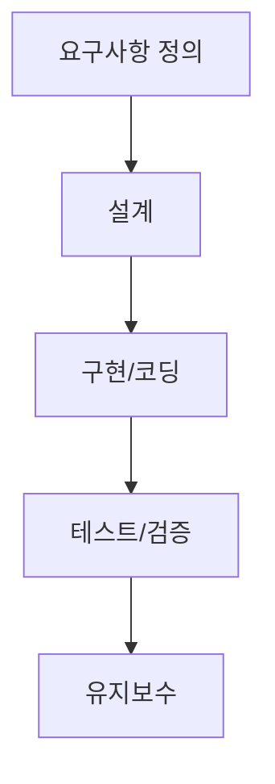



> 개발하다 도무지 이해가 안 가는 워크시스템 때문에 개발 방법론을 찾아봄. 수정요청→ 수정 →수정요청 →수정... 이 무한굴레?

{: #magnific}

# 🚀 Agile vs Waterfall: 개발 방법론의 모든 것

소프트웨어 개발 세계에서 가장 널리 알려진 두 가지 방법론인 Agile(에자일)과 Waterfall(워터폴)에 대해 깊이 있게 알아보겠습니다. 이 두 방법론은 접근 방식과 철학에서 근본적인 차이를 가지고 있으며, 프로젝트의 성격과 요구사항에 따라 선택적으로 적용됩니다.

## 📊 Agile과 Waterfall 핵심 비교

| 특성              | Waterfall (워터폴)   | Agile (에자일)          |
| ----------------- | -------------------- | ----------------------- |
| **기본 원칙**     | 순차적, 선형적 진행  | 반복적, 점진적 개발     |
| **프로세스 구조** | 엄격하게 정의된 단계 | 유연한 스프린트 기반    |
| **요구사항 관리** | 초기에 모두 정의     | 지속적 발견 및 변경     |
| **고객 참여**     | 주로 시작과 끝       | 전체 과정에 지속적 참여 |
| **변경 관리**     | 변경 저항적          | 변경 포용적             |
| **테스트 접근법** | 개발 후 테스트       | 지속적 통합 및 테스트   |
| **팀 구조**       | 계층적, 역할 기반    | 자기 조직화, 다기능 팀  |
| **문서화**        | 광범위하고 자세함    | 최소한의 필수 문서      |
| **릴리스 주기**   | 긴 주기 (월/년 단위) | 짧은 주기 (주/월 단위)  |
| **리스크 관리**   | 초기 식별 후 계획    | 지속적 감지 및 대응     |

## 🌊 Waterfall 방법론 심층 분석

Waterfall은 하나의 단계가 완전히 완료된 후에 다음 단계로 진행하는 순차적인 접근 방식을 취합니다. 마치 폭포수가 위에서 아래로 흐르는 것처럼, 프로젝트도 한 방향으로 진행됩니다.

### Waterfall의 단계별 흐름

### 각 단계 설명

| 단계              | 주요 활동                                                            | 산출물                                                |
| ----------------- | -------------------------------------------------------------------- | ----------------------------------------------------- |
| **요구사항 정의** | • 고객 인터뷰 • 비즈니스 분석 • 범위 정의                      | • 요구사항 명세서 • 프로젝트 계획서 • 범위 문서 |
| **설계**          | • 시스템 아키텍처 설계 • 데이터베이스 모델링 • 인터페이스 설계 | • 설계 문서                                           |
| **구현/코딩**     | • 코드 작성                                                          | • 완성된 소스 코드                                    |
| **테스트/검증**   | • 단위 테스트 • 통합 테스트                                       | • 테스트 보고서                                       |
| **유지보수**      | • 버그 수정 • 기능 추가                                           | • 유지보수 보고서                                     |

## 🧠 개인적 시각: 내가 느낀 관점

개발 직무로 전향한지 얼마 안 되었고, 이전에는 공장 생산관리를 담당했었는데, 그래서인지 Waterfall 방식이 제 몸에 더 잘 맞더라고요. 단계별로 차근차근 진행하는 그 명확함이 제조업에서 익숙해진 제 사고방식과 잘 어울리는 것 같아요.

Waterfall은 마치 레시피를 따라 요리하는 것처럼 편안한 느낌이에요. 무엇을, 언제, 어떻게 할지 미리 알 수 있거든요. 특히 팀이 지치지 않고 오래 갈 수 있는 방법은 아무래도 Waterfall인 것 같아요. 예측 가능한 일정과 명확한 단계가 주는 안정감이 있거든요.

반면에 Agile은... 음, 저에겐 처음엔 약간 카오스처럼 느껴졌어요! 😅 하지만 시스템을 처음부터 구축할 때는 이 유연함이 정말 큰 무기가 된다는 걸 깨달았어요. 특히 "이게 맞나?" 싶을 때 빠르게 방향을 전환할 수 있다는 점이 매력적이더라고요.

제 경험에서 보면 이런 상황에선 Waterfall이 좋았어요:

- 이미 데이터가 충분히 쌓여있고 무엇을 만들어야 할지 명확할 때
- 안정적인 결과물이 필요하고 큰 변화없이 진행해야 할 때
- 팀원들이 장기적으로 번아웃 없이 일해야 할 때

그리고 이런 경우엔 Agile이 더 효과적이었죠:

- 새로운 시스템을 바닥부터 만들 때 (아 이건 정말 Agile이 빛나는 순간이더라고요!)
- 사용자 경험이 최우선인 서비스 개발할 때
- "일단 해보고 개선하자" 식의 접근이 필요할 때

결국은 이 두 방법 중 무조건 하나만 고집할 필요는 없는 것 같아요. 저는 초반에 너무 "Waterfall이 최고야!"라는 생각이 강했는데, 지금은 상황에 맞게 유연하게 섞어 쓰는 게 현명하다고 느껴요. 어떤 방식이든 팀이 행복하게 일하고 좋은 제품을 만들 수 있다면, 그게 바로 최고의 방법론 아닐까요? 😊
