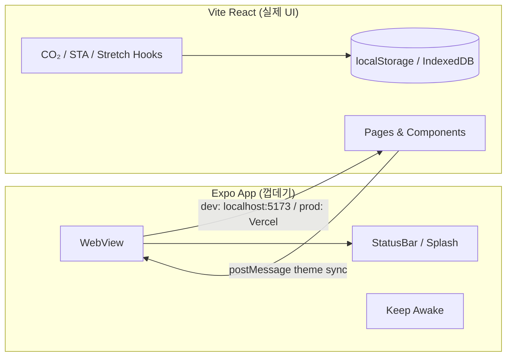



웹 개발만 하다가 **React Native를 직접 써보고**, **WebView로 앱 형태까지 확장**해 보고 싶어서 사이드 프로젝트를 만들었다.  
프리다이빙 드라이 훈련용 타이머 앱 [Apnea Train](https://github.com/POcodingWER/free_diving_training)을 만들면서 Expo 설정부터 iOS 시뮬레이터에서 앱이 돌아가는 것까지 경험한 내용을 정리한다.

- **GitHub:** [POcodingWER/free_diving_training](https://github.com/POcodingWER/free_diving_training)
- **라이브 데모:** [free-diving-training-web.vercel.app](https://free-diving-training-web.vercel.app)

---

## 왜 이 방식을 선택했나

React Native를 공부할 때 맞닥뜨리는 선택지는 대략 세 가지다.

| 접근               | 설명                         | 이번에 선택한 이유                                                        |
| ------------------ | ---------------------------- | ------------------------------------------------------------------------- |
| **순수 RN**        | 화면·로직 전부 React Native  | 학습 범위가 넓고, 이미 React 웹 경험이 있어서 UI를 두 번 짜고 싶지 않았다 |
| **WebView 껍데기** | 네이티브는 컨테이너, UI는 웹 | 기존 React 스택 재사용, Vercel 배포와 앱 스토어 경로를 동시에 열 수 있다  |
| **Expo**           | RN 개발 환경 추상화          | Xcode 설정 부담을 줄이고 시뮬레이터 실행까지 빠르게 확인할 수 있다        |

목표는 "네이티브 앱을 완성"하는 것보다 **React Native 생태계를 맛보고, WebView 패턴이 실제로 어떻게 동작하는지** 확인하는 것이었다.

---

## 전체 구조: WebView Monorepo

프로젝트는 npm workspaces 기반 모노레포다.

```
apnea-train/
├── web/     # Vite + React — 실제 UI·비즈니스 로직
├── app/     # Expo — WebView 껍데기
└── package.json
```



**핵심 아이디어:** UI는 웹에만 두고, 네이티브 레이어는 "앱처럼 보이게 만드는 일"만 담당한다.

- 화면 꺼짐 방지 (`expo-keep-awake`)
- 스플래시·StatusBar 테마 동기화
- WebView 스크롤 바운스·오버스크롤 비활성화
- 개발/프로덕션 URL 분기

---

## Expo WebView 껍데기 코드

앱의 실질적인 코드는 `app/app/index.tsx` 한 파일에 집중되어 있다.



```tsx
import { useKeepAwake } from "expo-keep-awake";
import { WebView } from "react-native-webview";
import { getWebAppUrl } from "@/constants/web-app-url";

export default function WebAppScreen() {
  useKeepAwake(); // 훈련 중 화면 꺼짐 방지

  return (
    <WebView
      source={{ uri: getWebAppUrl() }}
      javaScriptEnabled
      domStorageEnabled
      allowsInlineMediaPlayback
      mediaPlaybackRequiresUserAction={false}
      bounces={false}
      onMessage={onWebMessage} // 웹 → 네이티브 테마 동기화
      injectedJavaScriptBeforeContentLoaded={THEME_PROBE_SCRIPT}
    />
  );
}
```



### WebView에 신경 쓴 옵션

| 옵션                        | 이유                                      |
| --------------------------- | ----------------------------------------- |
| `domStorageEnabled`         | localStorage 기반 테마·훈련 기록 저장     |
| `useKeepAwake()`            | CO₂·STA 타이머 중 화면이 꺼지면 사용 불가 |
| `bounces={false}`           | iOS WebView 고무줄 스크롤 제거            |
| `overScrollMode="never"`    | Android 오버스크롤 제거                   |
| `allowsInlineMediaPlayback` | 스트레칭·음성 안내 재생                   |

숨 참기 타이머 앱이라 **화면이 꺼지지 않는 것**이 기능 요구사항에 가깝다. 이건 웹만으로는 모바일에서 한계가 있고, 네이티브 껍데기를 둔 이유 중 하나다.

---

## 개발 URL 분기 — 시뮬레이터에서 막혔던 부분

WebView는 `localhost`를 **기기 자신**으로 해석한다.  
맥에서 Vite dev 서버를 띄워도, 시뮬레이터/에뮬레이터 안의 WebView는 맥의 `localhost:5173`에 바로 닿지 않는다.

```typescript
export function getWebAppUrl(): string {
  if (!__DEV__) {
    return "https://free-diving-training-web.vercel.app";
  }

  const host = getDevHost(); // Expo가 알려주는 개발 머신 IP

  if (Platform.OS === "android") {
    return host ? `http://${host}:5173` : "http://10.0.2.2:5173";
  }

  return host ? `http://${host}:5173` : "http://localhost:5173";
}
```

정리하면:

- **iOS 시뮬레이터:** Expo `hostUri`로 맥 IP를 받아 `http://{맥IP}:5173` 연결
- **Android 에뮬레이터:** `10.0.2.2`가 호스트 머신의 localhost를 가리킴
- **프로덕션:** Vercel URL 로드

개발할 때는 루트에서 web + app을 동시에 띄운다.

```bash
npm install
npm run dev   # web(5173) + expo 동시 실행
```

WebView 연결 실패 시 앱에 에러 화면을 띄워 두었다. dev 서버가 꺼져 있으면 "웹 UI에 연결할 수 없습니다"와 함께 실행 방법을 안내한다.

---

## 웹 ↔ 네이티브 테마 동기화

다크/라이트 테마를 바꿀 때 **StatusBar 색**과 **WebView 바깥 배경**도 같이 맞춰야 앱처럼 보인다.

### 1) 첫 로드: injectedJavaScript

WebView가 뜨기 전에 `localStorage`의 테마 값을 읽어 네이티브로 보낸다.

```javascript
// THEME_PROBE_SCRIPT (요약)
var mode = localStorage.getItem('apnea-theme') || 'system';
var resolved = /* system이면 prefers-color-scheme, 아니면 저장값 */;
window.ReactNativeWebView.postMessage(JSON.stringify({ type: 'theme', resolved }));
```

### 2) 테마 변경: 웹에서 postMessage

```typescript
// web/src/utils/native-bridge.ts
export function notifyNativeShellTheme(resolved: "light" | "dark"): void {
  window.ReactNativeWebView?.postMessage(
    JSON.stringify({ type: "theme", resolved }),
  );
}
```

웹 브라우저에서는 `ReactNativeWebView`가 없으므로 optional chaining으로 무시되고, 앱 WebView 안에서만 동작한다. **같은 웹 코드로 브라우저·앱 둘 다 서비스**할 수 있는 패턴이다.

---

## iOS 시뮬레이터까지 돌려본 과정

### 1. 환경

- macOS + Xcode (시뮬레이터)
- Node.js + Expo CLI (`npx expo`)

### 2. 실행 순서

```bash
# 1) 의존성 설치
npm install

# 2) web dev 서버 + Expo 동시 실행
npm run dev

# 3) Expo 터미널에서 i 키 → iOS 시뮬레이터 실행
# 또는
npm run ios
```

처음 `expo run:ios`를 하면 네이티브 프로젝트 prebuild·Pod 설치가 진행된다. 시간은 좀 걸리지만, 한번 되면 이후는 `npm run dev` 후 시뮬레이터만 띄우면 된다.

### 3. 확인한 것

- WebView 안에서 React Router 라우팅 동작
- CO₂·STA 타이머, 음성 재생
- 테마 전환 시 StatusBar·배경색 동기화
- 훈련 중 화면 꺼짐 방지

**시뮬레이터에서 "앱이 돌아간다"는 감각**을 얻는 데는 이 정도면 충분했다. 실기기·스토어 배포(EAS Build)는 다음 단계로 남겨 두었다.

---

## WebView 방식의 장단점 (직접 느낀 점)

### 장점

- **웹 스택 100% 재사용** — React 19, Vite, React Router 그대로
- **배포가 단순** — 웹은 Vercel push 배포, 앱은 같은 URL을 WebView로 로드
- **학습 비용** — RN UI API(StyleSheet, FlatList 등)를 깊게 안 파도 앱 형태 확인 가능
- **기능 추가 속도** — 타이머·i18n·통계는 전부 web/에서 작업

### 단점

- **네이티브 UX 한계** — 제스처, 푸시, 백그라운드 동작 등은 껍데기 코드 추가 필요
- **오프라인** — 현재는 Vercel URL 로드 방식이라 네트워크 의존 (번들 내장은 TODO)
- **스토어 심사** — WebView 위주 앱은 리젝 사례도 있어, 네이티브 가치(keep-awake 등)를 명확히 해야 함
- **성능** — 복잡한 애니메이션·대량 리스트는 순수 RN보다 불리할 수 있음

이번 프로젝트처럼 **타이머·설정·기록 조회** 수준이면 WebView로도 충분했다. 게임이나 카메라·블루투스 연동이 핵심이면 순수 RN이나 네이티브 모듈을 검토하는 편이 낫다.

---

## 프로젝트에서 같이 해본 것들

앱 껍데기 외에 web/ 쪽에서 같이 구현해 본 내용이다.

| 영역      | 사용 기술                                                     |
| --------- | ------------------------------------------------------------- |
| UI        | React 19, TypeScript, Vite 6, React Router 7                  |
| 상태·로직 | `useCo2Session`, `useStaTimer`, `useStretchSession` 커스텀 훅 |
| 저장      | localStorage, IndexedDB                                       |
| i18n      | 한·영 locale 분리                                             |
| 분석      | GA4 (프로덕션만)                                              |
| 배포      | Vercel                                                        |

도메인은 프리다이빙 CO₂ 테이블·STA·스트레칭 루틴이라, 단순 CRUD가 아니라 **타이머 상태 머신**을 직접 짜 보는 것도 재미있었다.

---

## 마무리

React Native를 "제대로 배운다"는 목표보다, **Expo + WebView로 앱 실행 경험을 빠르게 쌓는 것**에 초점을 맞췄다.

얻은 것:

1. Expo 프로젝트 구조와 시뮬레이터 실행 흐름
2. WebView dev/prod URL 분기 (특히 Android `10.0.2.2`)
3. `postMessage`로 웹·네이티브 브릿지 만들기
4. 모노레포로 web + app 같이 돌리기

앞으로 순수 React Native UI를 더 파보거나, EAS Build로 TestFlight까지 올려 보는 것도 자연스러운 다음 단계다.  
비슷하게 "웹은 이미 있는데 앱도 필요하다"는 상황이면 WebView 껍데기부터 시작해 보는 것을 추천한다.

---

## 참고 링크

- [Apnea Train GitHub](https://github.com/POcodingWER/free_diving_training)
- [라이브 웹](https://free-diving-training-web.vercel.app)
- [Expo 문서](https://docs.expo.dev/)
- [react-native-webview](https://github.com/react-native-webview/react-native-webview)
